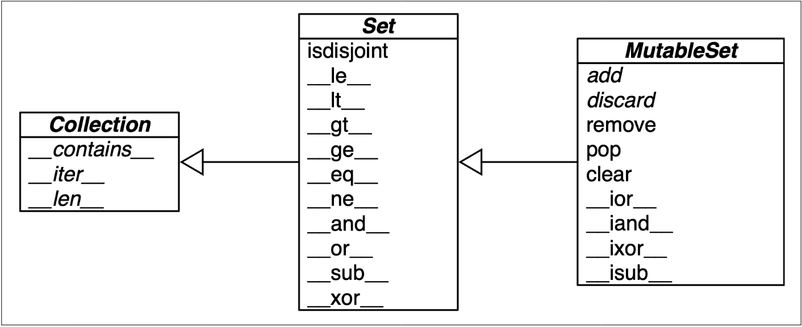

## Practical Consequences of How Sets Work

The set and frozenset types in Python are implemented using a hash table. This implementation has several practical consequences:

### Key Points

1. **Hashable Elements**: 
   - Set elements must be hashable objects. They need to implement proper `__hash__` and `__eq__` methods.
   - **Example**:
     ```python
     class HashableObject:
         def __init__(self, value):
             self.value = value

         def __hash__(self):
             return hash(self.value)

         def __eq__(self, other):
             return self.value == other.value

     s = {HashableObject(1), HashableObject(2)}
     print(s)
     ```

2. **Efficient Membership Testing**:
   - Membership testing is very efficient. A set may have millions of elements, but an element can be located directly by computing its hash code.
   - **Example**:
     ```python
     s = {1, 2, 3}
     print(1 in s)  # Output: True
     print(4 in s)  # Output: False
     ```

3. **Memory Overhead**:
   - Sets have a significant memory overhead compared to a low-level array of pointers to its elements.

4. **Element Ordering**:
   - Element ordering in sets depends on the insertion order, but it is not reliable for any specific order.
   - Adding elements may change the order of existing elements due to the resizing of the hash table.

### Set Operations

Python sets provide a rich set of operations. The image provided shows a simplified UML class diagram for `MutableSet` and its superclasses from `collections.abc`.


Here are some of the operations explained:

1. **Intersection (`&`)**:
   - **Example**:
     ```python
     a = {1, 2, 3}
     b = {2, 3, 4}
     print(a & b)  # Output: {2, 3}
     ```

2. **Union (`|`)**:
   - **Example**:
     ```python
     a = {1, 2, 3}
     b = {3, 4, 5}
     print(a | b)  # Output: {1, 2, 3, 4, 5}
     ```

3. **Difference (`-`)**:
   - **Example**:
     ```python
     a = {1, 2, 3}
     b = {2, 3, 4}
     print(a - b)  # Output: {1}
     ```

4. **Symmetric Difference (`^`)**:
   - **Example**:
     ```python
     a = {1, 2, 3}
     b = {2, 3, 4}
     print(a ^ b)  # Output: {1, 4}
     ```

### Mathematical Set Operations

The following table summarizes mathematical set operations and their corresponding Python methods:

| Math Symbol | Python Operator | Method | Description |
| ----------- | ---------------- | ------ | ----------- |
| S ∩ Z       | s & z            | s.__and__(z) | Intersection of s and z |
| S ∪ Z       | s \| z           | s.__or__(z) | Union of s and z |
| S \ Z       | s - z            | s.__sub__(z) | Difference between s and z |
| S ∆ Z       | s ^ z            | s.__xor__(z) | Symmetric difference between s and z |

### Set Predicates

Set predicates are operators and methods that return `True` or `False`. Here are some examples:

- **isdisjoint()**:
  - **Example**:
    ```python
    a = {1, 2, 3}
    b = {4, 5, 6}
    print(a.isdisjoint(b))  # Output: True
    ```

- **issubset()**:
  - **Example**:
    ```python
    a = {1, 2}
    b = {1, 2, 3}
    print(a.issubset(b))  # Output: True
    ```

- **issuperset()**:
  - **Example**:
    ```python
    a = {1, 2, 3}
    b = {1, 2}
    print(a.issuperset(b))  # Output: True
    ```

### Additional Set Methods

The following table summarizes additional methods available for sets:

| Method           | Set | Frozenset | Description |
| ---------------- | --- | --------- | ----------- |
| s.add(e)         | ●   |           | Add element e to s |
| s.clear()        | ●   |           | Remove all elements of s |
| s.copy()         | ●   | ●         | Shallow copy of s |
| s.discard(e)     | ●   |           | Remove element e from s if it is present |
| s.__iter__()     | ●   | ●         | Get iterator over s |
| s.__len__()      | ●   | ●         | len(s) |
| s.pop()          | ●   |           | Remove and return an element from s, raising KeyError if s is empty |
| s.remove(e)      | ●   |           | Remove element e from s, raising KeyError if e not in s |

---

This concludes the overview of the practical consequences of how sets work, along with their rich set of operations and methods. If you have any further questions or need additional details, feel free to ask!


# Set Operations on `dict` Views

Python provides powerful set operations that can be used directly on dictionary views returned by the `.keys()` and `.items()` methods. These views are remarkably similar to `frozenset`.

## Table of Methods

The following table shows the methods implemented by `frozenset`, `dict_keys`, and `dict_items`.

| Method                        | `frozenset` | `dict_keys` | `dict_items` | Description                                             |
|-------------------------------|-------------|-------------|--------------|---------------------------------------------------------|
| `s.__and__(z)`                | ●           | ●           | ●            | `s & z` (intersection of `s` and `z`)                   |
| `s.__rand__(z)`               | ●           | ●           | ●            | Reversed `&` operator                                   |
| `s.__contains__(e)`           | ●           | ●           | ●            | `e in s`                                                |
| `s.copy()`                    | ●           |             |              | Shallow copy of `s`                                     |
| `s.difference(it, …)`         | ●           |             |              | Difference between `s` and iterables `it`, etc.         |
| `s.intersection(it, …)`       | ●           |             |              | Intersection of `s` and iterables `it`, etc.            |
| `s.isdisjoint(z)`             | ●           | ●           | ●            | `s` and `z` are disjoint (no elements in common)        |
| `s.issubset(it)`              | ●           |             |              | `s` is a subset of iterable `it`                        |
| `s.issuperset(it)`            | ●           |             |              | `s` is a superset of iterable `it`                      |
| `s.__iter__()`                | ●           | ●           | ●            | Get iterator over `s`                                   |
| `s.__len__()`                 | ●           | ●           | ●            | `len(s)`                                                |
| `s.__or__(z)`                 | ●           | ●           | ●            | `s \| z` (union of `s` and `z`)                          |
| `s.__ror__()`                 | ●           | ●           | ●            | Reversed `\|` operator                                   |
| `s.__reversed__()`            | ●           |             |              | Get iterator over `s` in reverse order                  |
| `s.__rsub__(z)`               | ●           | ●           | ●            | Reversed `-` operator                                   |
| `s.__sub__(z)`                | ●           | ●           | ●            | `s - z` (difference between `s` and `z`)                |
| `s.symmetric_difference(it)`  | ●           |             |              | Complement of `s & set(it)`                             |
| `s.union(it, …)`              | ●           |             |              | Union of `s` and iterables `it`, etc.                   |
| `s.__xor__()`                 | ●           | ●           | ●            | `s ^ z` (symmetric difference of `s` and `z`)           |
| `s.__rxor__()`                | ●           | ●           | ●            | Reversed `^` operator                                   |

## Example: Using Set Operations on `dict` Views

### Intersection of Keys

Using `&` to get the keys that appear in two dictionaries:

```python
d1 = dict(a=1, b=2, c=3, d=4)
d2 = dict(b=20, d=40, e=50)
common_keys = d1.keys() & d2.keys()
print(common_keys)  # Output: {'b', 'd'}
```

### Union of Keys with a Set

Dictionary views are compatible with set instances:

```python
s = {'a', 'e', 'i'}
union_keys = d1.keys() | s
print(union_keys)  # Output: {'a', 'c', 'b', 'd', 'i', 'e'}
```

### Intersection of Items

To use `dict_items` views with set operations, all values in the dictionary must be hashable. If values are not hashable, a `TypeError` will be raised.

```python
d1 = dict(a=1, b=2, c=3, d=4)
d2 = dict(b=20, d=40, e=50)
common_items = d1.items() & d2.items()
print(common_items)  # Output: {('b', 2)}
```

### Handling Unhashable Values

If a dictionary has unhashable values, attempting set operations on a `dict_items` view will raise a `TypeError`.

```python
d1 = dict(a=[1, 2], b=2)  # Lists are unhashable
try:
    common_items = d1.items() & d2.items()
except TypeError as e:
    print(e)  # Output: unhashable type: 'list'
```

## Conclusion

Using set operators with dictionary views can save a lot of loops and conditionals when inspecting the contents of dictionaries in your code. Leveraging Python’s efficient implementation in C can make your code more concise and efficient. 

Remember:
- `dict_keys` views can always be used as a set because dictionary keys are hashable by definition.
- `dict_items` views can only be used as sets if all the values in the dictionary are hashable.