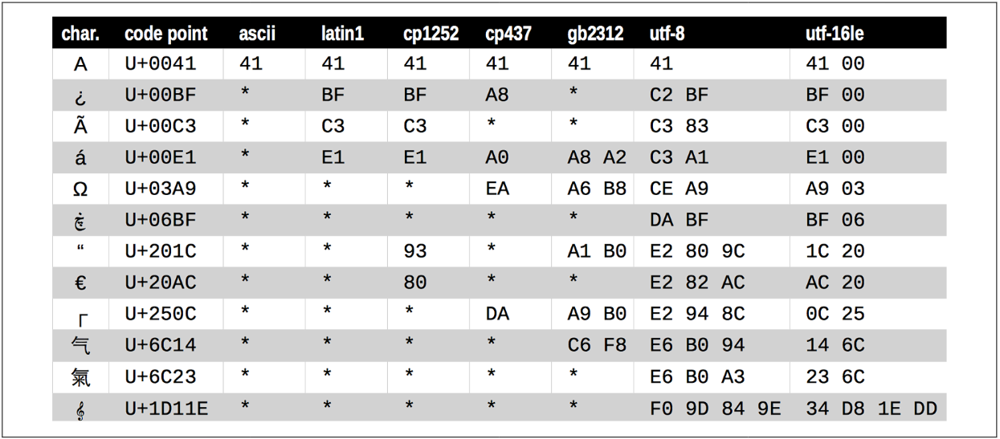

### Basic Encoders/Decoders

The Python distribution bundles more than 100 codecs (encoder/decoders) for converting text to bytes and vice versa. Each codec has a name, like 'utf_8', and often aliases, such as 'utf8', 'utf-8', and 'U8'. These codecs can be used as the encoding argument in functions like `open()`, `str.encode()`, `bytes.decode()`, and so on.

#### Example: Encoding a String with Different Codecs

The following example shows the same text encoded as three different byte sequences.

```python
for codec in ['latin_1', 'utf_8', 'utf_16']:
    print(codec, 'El Niño'.encode(codec), sep='\t')
```

Output:
```
latin_1    b'El Ni\xf1o'
utf_8      b'El Ni\xc3\xb1o'
utf_16     b'\xff\xfeE\x00l\x00 \x00N\x00i\x00\xf1\x00o\x00'
```

In this example:
- **latin_1**: Encodes 'El Niño' into `b'El Ni\xf1o'`, where `\xf1` represents the 'ñ' character.
- **utf_8**: Encodes 'El Niño' into `b'El Ni\xc3\xb1o'`, where `\xc3\xb1` represents the 'ñ' character.
- **utf_16**: Encodes 'El Niño' into `b'\xff\xfeE\x00l\x00 \x00N\x00i\x00\xf1\x00o\x00'`, where each character is represented by two bytes, and `\xff\xfe` is a byte order mark.

#### Character Encoding Table

The table below demonstrates a variety of codecs generating bytes from characters like the letter “A” through the G-clef musical symbol. Note that the last three encodings are variable-length, multibyte encodings.



- An asterisk (*) indicates that the character cannot be represented in that encoding.
- UTF encodings are designed to handle every Unicode code point.

### Common Encodings

- **latin1 (iso8859_1)**: Basis for other encodings, such as cp1252 and Unicode itself.
- **cp1252**: A useful latin1 superset created by Microsoft, adding symbols like curly quotes and € (euro).
- **cp437**: Original character set of the IBM PC, with box drawing characters. Incompatible with latin1.
- **gb2312**: Legacy standard to encode simplified Chinese ideographs used in mainland China.
- **utf-8**: The most common 8-bit encoding on the web, able to represent every Unicode character.
- **utf-16le**: A form of the UTF 16-bit encoding scheme, supporting code points beyond U+FFFF through surrogate pairs.

### Handling Encoding and Decoding Issues

When working with text in Python, it's important to be aware of the encoding used. Misunderstanding the encoding can lead to errors or data corruption. Use the appropriate codec to encode or decode text as needed.

#### Example: Encoding and Decoding Text

```python
text = "El Niño"
encoded_text = text.encode('utf_8')
print(encoded_text)  # b'El Ni\xc3\xb1o'

decoded_text = encoded_text.decode('utf_8')
print(decoded_text)  # El Niño
```

In this example:
- `text.encode('utf_8')` converts the string to bytes using the UTF-8 encoding.
- `encoded_text.decode('utf_8')` converts the bytes back to a string using the UTF-8 decoding.

By understanding and correctly using text encodings, you can ensure that your applications handle text data accurately and efficiently.