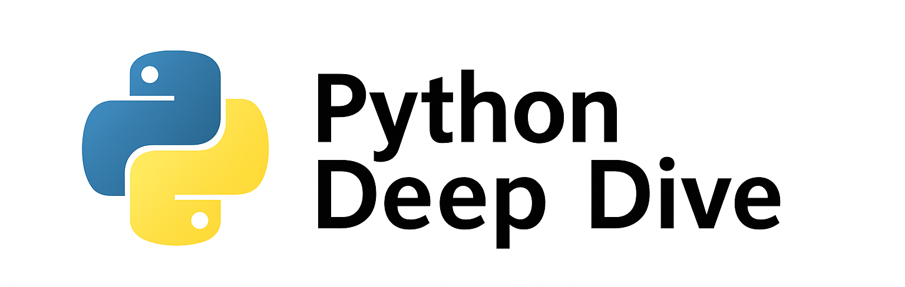

<p align="center">

</p>

<p align="center">
  
  
  
  
</p>


> **Python Deep Dive** Welcome to the Python Deep Dive repository! This project is designed to provide a comprehensive guide to Python programming, covering fundamental to advanced topics. Whether you're a beginner or an experienced developer looking to dive deeper into Python, this repository has something for you!

---

## 📚 Table of Contents

- [📚 Table of Contents](#-table-of-contents)
- [📂 Repository Structure](#-repository-structure)
- [⚙️ Setup Instructions](#️-setup-instructions)
- [🤿 Dive Into Modules](#-dive-into-modules)
- [📌 Roadmap](#-roadmap)
- [🙌 Contributing](#-contributing)
- [📄 License](#-license)
- [💬 Feedback](#-feedback)

---

## 📂 Repository Structure

This repository is divided into sections for every stage of your Python journey:

| Section | Description |
|--------|-------------|
| [**01_python_fundamentals** 📝](https://github.com/HashimThePassionate/Python-Deep-Dive/tree/main/01_python_fundamentals) | Basics of Python – variables, loops, data types, functions, etc. |
| [**02_object_oriented_programming** 🧱](https://github.com/HashimThePassionate/Python-Deep-Dive/tree/main/02_object_oriented_programming) | Understand OOP – classes, inheritance, encapsulation, and more. |
| [**03_data_structures** 📊](https://github.com/HashimThePassionate/Python-Deep-Dive/tree/main/03_data_structures) _(In Progress)_ | linkedlist, stack, queue and more |
| [**04_algorithms** 🔍](https://github.com/HashimThePassionate/Python-Deep-Dive/tree/main/04_algorithms) _(In Progress)_ | Sorting, searching, recursion, dynamic programming, etc. |
| [**05_design_patterns** 🏗️](https://github.com/HashimThePassionate/Python-Deep-Dive/tree/main/05_design_patterns) _(In Progress)_ | Learn patterns like Singleton, Factory, Observer, and more. |
| [**06_python_projects_for_beginners** 🛠️](https://github.com/HashimThePassionate/Python-Deep-Dive/tree/main/06_python_projects_for_beginners) _(In Progress)_ | Build mini-projects to practice Python hands-on. |
| [**07_cpython** 🔬](https://github.com/HashimThePassionate/Python-Deep-Dive/tree/main/07_cpython) _(In Progress)_ | Dive into the CPython internals and explore behind-the-scenes of Python. |
| [**The-Zen-Of-Python** 🧘](https://github.com/HashimThePassionate/Python-Deep-Dive/tree/main/The-Zen-Of-Python) | The philosophy behind Python development by Tim Peters. |

---

## ⚙️ Setup Instructions

> ⚠️ No complex setup needed for most files.

1. Clone this repository:
```bash
   git clone https://github.com/HashimThePassionate/Python-Deep-Dive.git
   cd Python-Deep-Dive
```

2. Make sure Python is installed:
```bash
   python --version
```

3. Start exploring topics via directories 📂

---

## 🤿 Dive Into Modules

Each module contains:

✅ Topic-wise folders </br>
✅ Python `.py` files  </br>
✅ Concepts explained with readme and comments  </br>
✅ Real-world analogies where applicable  </br>
✅ Mini challenges and hands-on practice

---

## 📌 Roadmap

* [x] Python Fundamentals
* [x] Object-Oriented Programming (OOP)
* [ ] Data Structures (WIP)
* [ ] Algorithms (WIP)
* [ ] Design Patterns (WIP)
* [ ] Beginner Projects (WIP)
* [ ] CPython Internals (WIP)

📢 *Check back regularly for updates! New content is added daily.*

---

## 🙌 Contributing

We ❤️ contributions from the community!

1. Fork the repository 🍴
2. Create your feature branch: `git checkout -b feature/awesome-feature`
3. Commit your changes: `git commit -m "Add awesome feature"`
4. Push to the branch: `git push origin feature/awesome-feature`
5. Open a Pull Request

We’ll review and merge your PR as soon as possible.
📄 *See [`CONTRIBUTING.md`](./CONTRIBUTING.md) for more info (Coming Soon)*

---

## 📄 License

This project is licensed under the [MIT License](./LICENSE) — feel free to use, share, and build upon it.

---

## 💬 Feedback

Found a bug? Have a suggestion?
➡️ [Open an issue](https://github.com/HashimThePassionate/Python-Deep-Dive/issues)

You can also reach out on GitHub discussions!

---

> ⭐ **Star** this repository to support and stay updated with the latest content!

